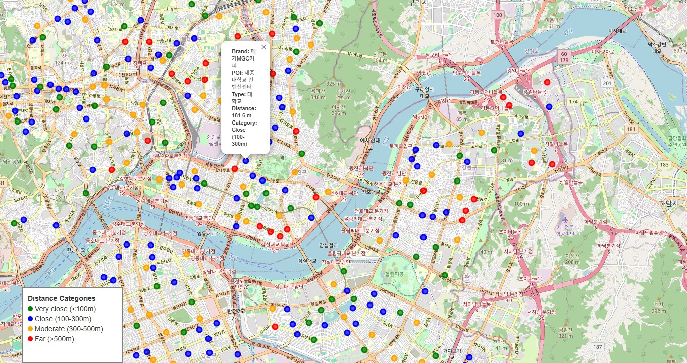

# ☕ Mega Coffee Location Intelligence in South Korea  
**Analyzing 3,000+ branch locations to uncover business insights using data science and geospatial analytics.**

---

## 📖 Project Overview

Mega Coffee is South Korea’s largest coffee franchise, with **over 3,000 stores nationwide**.  
Surprisingly, despite its size, **there is no open public dataset** or official data about its branch distribution.  

To fill this gap, I conducted a full **data mining and geospatial analysis** — from **web scraping** to **clustering, visualization, and business insights**.

This project demonstrates how **location data** alone can drive **real-world business strategy** decisions such as branch expansion, marketing focus, and competition mapping.

---

## 🧩 Project Steps

### 1. Data Collection (Web Scraping)
- Source: [KakaoMap](https://map.kakao.com/)
- Method: Selenium-based web scraping  
- Collected fields:
  - `city`, `district`, `neighborhood`
  - `latitude`, `longitude`
  - `address_name`, `phone`, `place_url`
  - `brand` (Mega Coffee)
- Final dataset: **3,188 branch locations**

### 2. Data Cleaning & Integration
- Cleaned duplicates, missing coordinates, and wrong records.
- Added **population data** by region.
- Merged with **nearest Points of Interest (POI)** dataset:
  - Universities 🎓  
  - Metro Stations 🚇  
  - Shopping Malls 🏬  

### 3. Exploratory Data Analysis (EDA)
Analyzed:
- Distribution of branches across **cities and districts**
- **Population vs. branch density**
- **Distance** between Mega Coffee and nearest POIs

---

## 🧠 Analytical Methods

### 🔹 Clustering
Used **K-Means (k=5)** to group branches based on latitude and longitude:

| Cluster | Color | Description |
|----------|--------|-------------|
| 0 | 🔴 Red | Central / High-Density Commercial Areas |
| 1 | 🔵 Blue | Coastal or Southern Districts |
| 2 | 🟢 Green | Mid-Density Urban Zones |
| 3 | 🟣 Purple | Suburban or Residential Areas |
| 4 | 🟠 Orange | Remote / Low-Density Rural Areas |

Visualized results on a scatter map using **Matplotlib** and **Folium**.

### 🔹 Distance Analysis
- Computed the distance between each Mega Coffee branch and nearby:
  - **University**
  - **Metro Station**
  - **Shopping Mall**
- Filtered branches **within 500 meters** of these POIs.

### 🔹 Power BI Dashboard
- Built an **interactive dashboard** with:
  - City-level and district-level branch counts
  - Branches per 10k people
  - Cluster distribution by region
  - Average nearest POI distance
  - Potential underserved areas (high population, few branches)

---

## 📊 Key Results

| Metric | Value | Insight |
|--------|--------|---------|
| **Total Branches Scraped** | 3,188 | Nationwide coverage |
| **Branches within 500m of POI** | 1,480 | 46% of all branches near metro/university/mall |
| **Top Cities** | Seoul, Busan, Gyeonggi | Overserved markets |
| **Underserved Areas** | Daejeon, Jeonbuk, Gangwon | Expansion potential |
| **Average Distance to Nearest POI** | ~420 meters | Strong foot-traffic positioning |

### 🗺️ Visualization Outputs:
- **Scatter Map:** K-Means clustering of branch locations  
- **Heatmap:** Branch density vs population  
- **Folium Map:** Interactive map of branches & POIs  
- **Power BI Dashboard:** Dynamic visualization of trends

---

## 💡 Insights & Business Interpretation

- **High saturation** in Seoul, Busan, and Gyeonggi — intense competition zones.  
- **Low saturation** in central and rural areas — potential for new branch openings.  
- Nearly half of all branches are located **within 500 meters** of major POIs — confirming a **visibility-first, high-footfall strategy**.  
- Branches far from POIs often appear near **intersections or highways**, showing a **transit-oriented approach**.  

---

## 🧠 Machine Learning Component

- Algorithm: `KMeans(n_clusters=5, random_state=42)`
- Features used: `latitude`, `longitude`
- Evaluation: Spatial cohesion and business interpretability
- Output: Cluster label assigned to each branch

---

## 📍 Example Visual

---

## 🧰 Tools & Technologies

| Category | Tools |
|-----------|-------|
| Programming | Python (Pandas, NumPy, Matplotlib, Scikit-learn, Folium) |
| Web Scraping | Selenium, BeautifulSoup |
| Data Visualization | Power BI, Folium |
| Data Storage | CSV, Excel |
| Environment | Jupyter Notebook |

---

## 🚀 Future Work

- Incorporate **sales data** and **customer demographics**
- Predict **optimal branch placement** using regression or spatial modeling
- Build an **automated dashboard pipeline** (Python → Power BI → Web)
- Compare **Mega Coffee** with other chains (e.g., Starbucks, Ediya)

---

## 📫 Author

👤 **Muhammadjon Raxmataliev**  
📍 Data Analyst | Machine Learning Enthusiast  
📧 [rakhmatalievm@gmail.com]  
🔗 ([https://linkedin.com/in/yourprofile](https://www.linkedin.com/in/muhammadjon-raxmataliyev-56381b236/))  
🔗 [Your GitHub](https://github.com/MuhammadjonR)

---

## 🏁 Conclusion

This project proves that even without direct sales or customer data,  
**location data alone can reveal powerful business insights.**

From **simple scraping** to **strategic recommendations**,  
this work shows how **data science bridges the gap** between **raw data** and **business decision-making**.

> “From an ordinary map to a complete business insight — one dataset at a time.”

---

